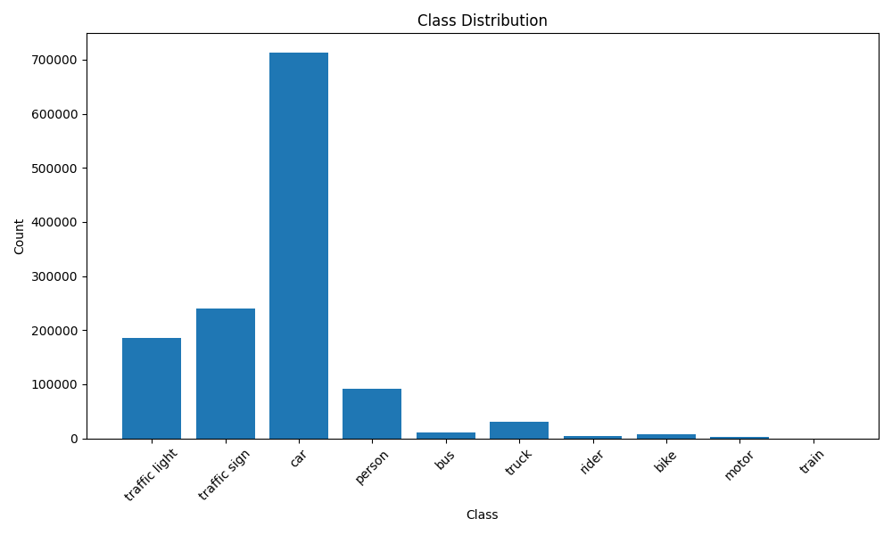
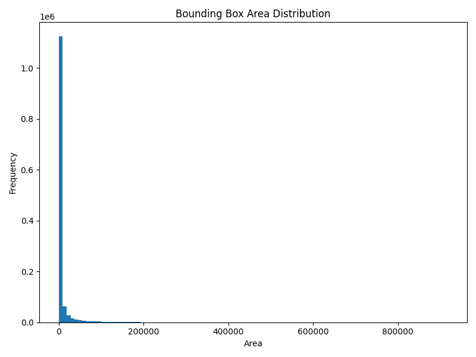
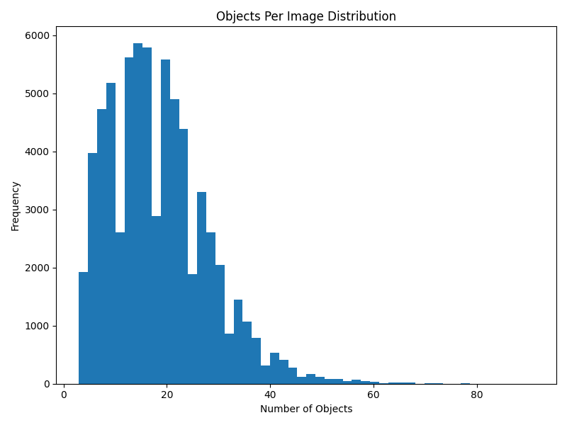
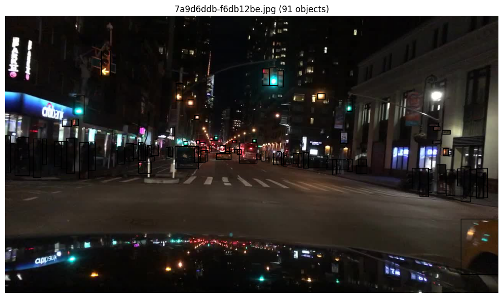
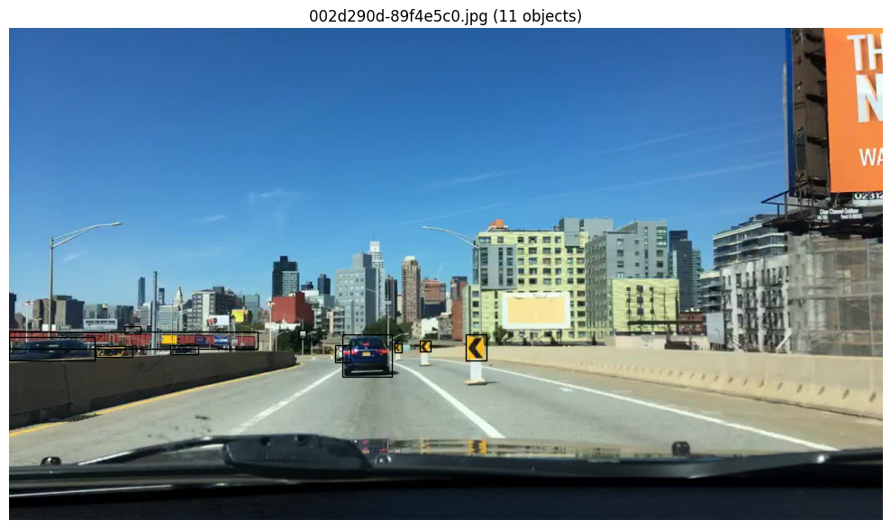
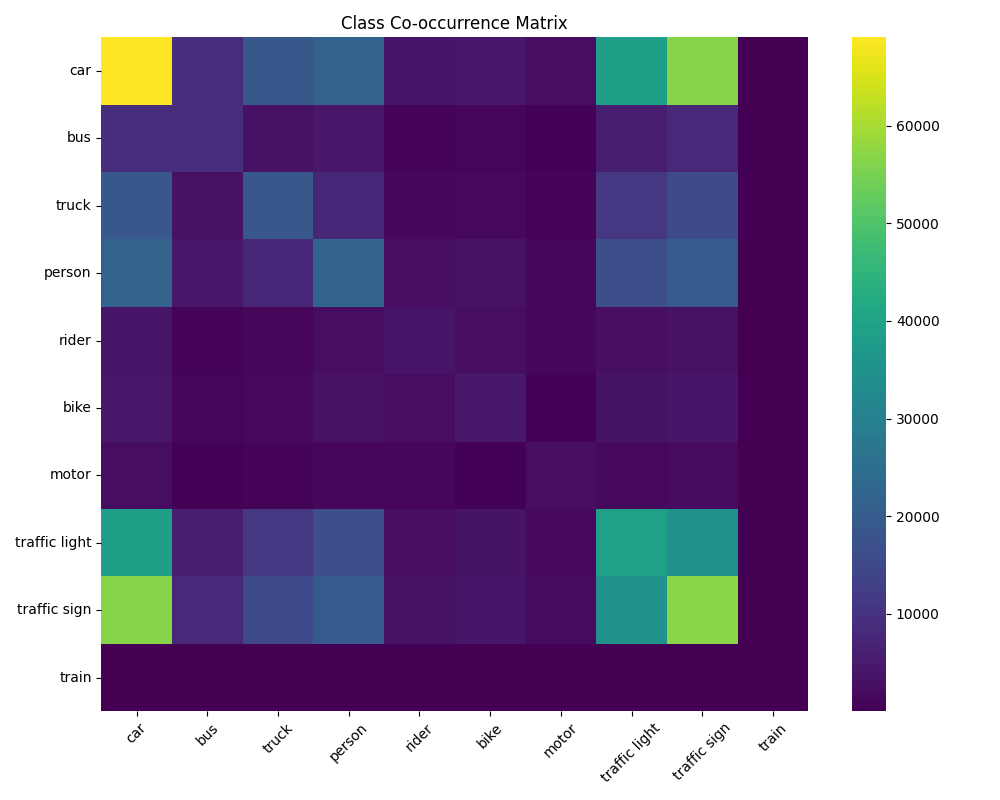

# Data Analysis Report  
---

# 1. Dataset Overview

The BDD100K dataset was analyzed to understand class imbalance, object scale distribution, spatial priors, co-occurrence patterns, and scene density.

Only the 10 object detection classes with bounding box annotations were considered, as required.

---

## Training Split Summary

- **Total Images:** 69,863  
- **Total Objects:** 1,286,871  
- **Average Objects per Image:** 18.42  
- **Median Objects per Image:** 17  
- **Maximum Objects in a Single Image:** 91  

This indicates that BDD100K contains dense urban scenes with many objects per frame.

---

# 2. Class Distribution

The class distribution plot clearly shows:

- `car` overwhelmingly dominates the dataset.
- `traffic sign` and `traffic light` are also highly represented.
- `train` is extremely rare (only 136 instances).
- Two-wheeler classes (`bike`, `rider`, `motor`) are underrepresented.

### Key Observations

1. Severe long-tail imbalance exists.
2. The model is likely to bias toward dominant classes.
3. Rare classes (especially `train`) may suffer from poor generalization.

### Modeling Implication

Class imbalance must be considered during evaluation and potentially addressed through:
- Class-balanced sampling
- Weighted losses
- Data augmentation

---

# 3. Bounding Box Area Distribution

The area histogram is heavily right-skewed.

### What This Plot Shows

- A massive concentration of very small bounding boxes.
- Very few extremely large objects.
- A long tail extending toward large area values.

### Interpretation

Approximately 55% of objects fall into the small category.

This confirms:
- Long-distance detection is common.
- Traffic lights and signs are often small-scale.
- Small-object detection is a major challenge.

### Modeling Implication

A multi-scale architecture (e.g., Feature Pyramid Network) is necessary to capture small objects effectively.

---

# 4. Objects Per Image Distribution

This histogram shows:

- Most images contain 10–25 objects.
- A long tail extends beyond 50 objects.
- Some extreme scenes contain over 90 objects.

### Interpretation

The dataset contains many crowded scenes.

### Modeling Implication

The detector must:
- Handle overlapping bounding boxes.
- Avoid duplicate detections.
- Perform well in dense urban scenarios.

Region-based detectors are well suited for such structured crowded environments.

---

# 5. Example: Most Crowded Image

This image contains **91 objects**.

### Observations

- Numerous distant traffic lights.
- Heavy vehicle clustering.
- Nighttime urban environment.
- Many small bounding boxes.

### Implication

- Dense object detection is required.
- Small-object detection becomes even harder in night scenes.
- Scene complexity increases detection difficulty.

---

# 6. Rare Class Example (Train)

The `train` class appears very rarely in the dataset.

### Observations

- Large-scale object.
- Appears in very specific scene contexts.
- Extremely limited training samples.

### Implication

Rare classes may exhibit:
- Poor generalization
- Overfitting risk
- Low recall during evaluation

This was later confirmed in model evaluation.

---

# 7. Class Co-occurrence Analysis

The co-occurrence matrix reveals strong contextual pairings.

### Strong Pairings

- `car` ↔ `traffic sign`
- `car` ↔ `traffic light`

### Interpretation

Urban driving scenes exhibit structured relationships:
- Infrastructure appears alongside vehicles.

### Modeling Implication

Frequent co-occurrence between visually similar classes (person & rider) may lead to classification confusion.

---

# 8. Spatial Distribution (Heatmaps)

Spatial heatmaps (generated per class) reveal strong positional priors:

- Vehicles cluster in central lower regions.
- Traffic lights appear in upper portions.
- Signs show roadside patterns.

### Interpretation

BDD100K scenes follow structured road layouts.

### Implication

Models may implicitly learn spatial priors.
However, reliance on spatial bias may reduce generalization in unusual scenes.

---

# 9. Key Dataset Challenges Identified

1. Severe class imbalance
2. Dominance of small objects
3. Dense scenes with overlapping instances
4. Strong spatial priors
5. Rare class scarcity

---

# 10. Design Implications for Model Selection

Based on analysis, the chosen model must:

- Support multi-scale detection
- Handle small-object localization
- Perform robustly in crowded scenes
- Manage class imbalance effects
- Provide strong bounding box regression accuracy

This analysis directly motivated the selection of **Faster R-CNN with ResNet50-FPN**.

---

# 11. Connection to Evaluation Results

Later evaluation confirmed:

- High AP for dominant classes (`car`)
- Lower AP for rare classes (`train`)
- Reduced performance on small-object categories (`bike`, `rider`)
- Class confusion between co-occurring classes

This demonstrates that model behavior strongly aligns with dataset characteristics.

---

# Conclusion

The BDD100K object detection dataset presents:

- A long-tail class distribution
- Strong small-object dominance
- Structured spatial priors
- High-density urban scenes

These characteristics significantly influence model selection, training behavior, and evaluation outcomes.

The data analysis phase provided essential insights that guided architectural decisions and performance interpretation.

---
