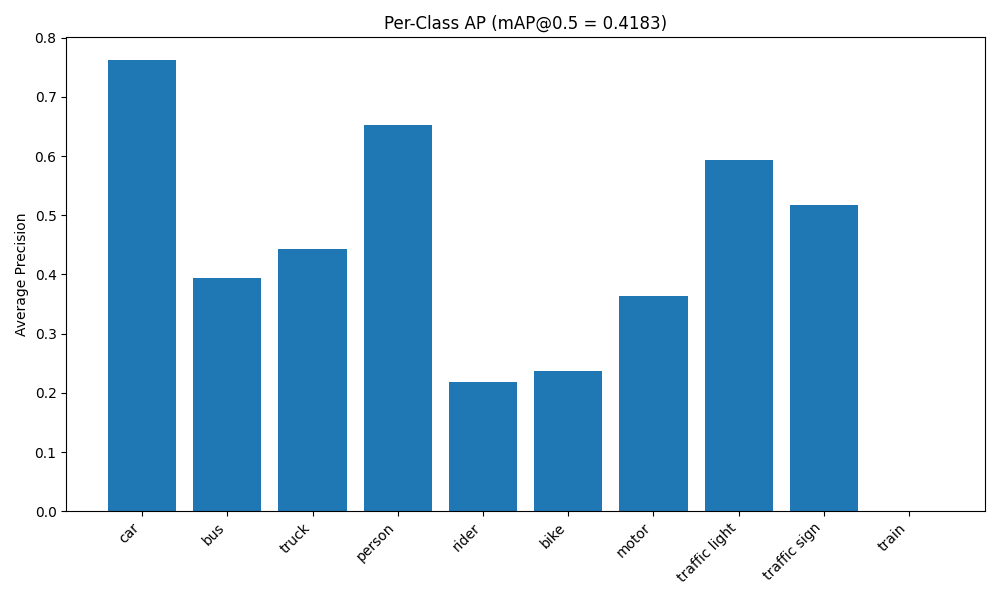
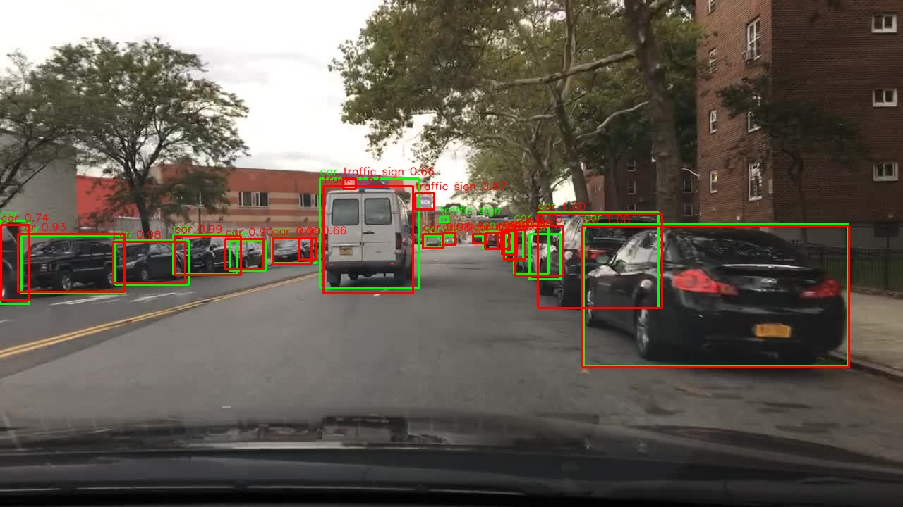

# Evaluation & Visualization Report  
**Applied Computer Vision Assignment – Object Detection on BDD100K**

---

# 1. Experimental Setup

## 1.1 Dataset

The model was evaluated on the **BDD100K validation split** for object detection.

- Detection classes considered: 10
- Validation subset used for evaluation: 200 images (for rapid iteration and reproducibility)
- Only bounding-box based object detection labels were used.
- Semantic segmentation and lane/drivable area annotations were excluded.

---

## 1.2 Model

Model used: **Faster R-CNN with ResNet50-FPN backbone**

- Pretrained on COCO
- Final detection head adapted to 10 classes (+ background)
- Background class handled internally as required by Faster R-CNN
- Trained for 5 epochs
- Optimizer: AdamW (LR = 1e-4)
- LR Scheduler: StepLR (step_size=2, gamma=0.1)
- Batch size: 2
- Training subset: 1000 images

---

# 2. Quantitative Evaluation

## 2.1 Metric Selection

The chosen metric for evaluation is:

### **mAP@0.5 (Mean Average Precision at IoU threshold 0.5)**

### Why mAP@0.5?

- Standard metric in object detection literature
- Measures both localization and classification accuracy
- Provides per-class interpretability
- Computationally feasible for subset evaluation
- Suitable for validating model performance trends

AP is computed using **11-point interpolation**, following traditional VOC-style evaluation.

---

## 2.2 Final Results (Epoch 5)

### Overall Performance
`mAP@0.5: 0.4183`

This represents a significant improvement from the 1-epoch baseline (~0.29), demonstrating successful convergence.

---

## 2.3 Per-Class AP

| Class | AP |
|-------|------|
| car | 0.7625 |
| person | 0.6525 |
| traffic light | 0.5937 |
| traffic sign | 0.5173 |
| truck | 0.4438 |
| bus | 0.3947 |
| motor | 0.3636 |
| bike | 0.2364 |
| rider | 0.2184 |
| train | 0.0000 |

---

## 2.4 AP Per Class Visualization

The bar plot clearly shows strong performance on dominant classes (car, person)
and weak performance on rare classes (train).

---

# 3. Quantitative Analysis

## 3.1 Strong Performing Classes

### Car (0.76)
- Dominant class in dataset
- Large object sizes
- Clear bounding box structure
- High sample frequency

### Person (0.65)
- Frequent class
- Moderate object size distribution
- Structured spatial placement (mostly road-level)

### Traffic Light / Sign (~0.5–0.59)
- Spatially structured (top region of image)
- Distinctive shapes
- Benefit from FPN multi-scale features

---

## 3.2 Medium Performance Classes

### Truck / Bus (~0.39–0.44)
- Similar appearance to cars
- Lower frequency than cars
- Some class confusion observed

### Motor (~0.36)
- Moderate representation
- Smaller bounding boxes compared to cars

---

## 3.3 Weak Performing Classes

### Bike (0.23) and Rider (0.21)
- Often small objects
- Heavy occlusion
- Frequently appear together
- Class confusion between rider & person

### Train (0.00)
- Extremely rare class
- Very few training examples
- Model fails to generalize due to low representation

---

# 4. Qualitative Analysis

Qualitative results were generated by overlaying:

- Ground truth bounding boxes (green)
- Model predictions (red, score > 0.5)

Ground truth boxes are shown in green and model predictions in red.

### Example 1

### Example 2 

## Observed Success Cases

- Clear frontal cars
- Pedestrians at mid-range distance
- Traffic signs in uncluttered scenes

## Observed Failure Patterns

### 1. Small Object Misses
- Distant traffic lights
- Small riders
- Distant bikes

This aligns with dataset analysis showing:
- 55% of objects are small

---

### 2. Class Confusion

Observed confusion between:
- Person vs Rider
- Car vs Truck
- Bike vs Motor

This is likely due to:
- Similar visual appearance
- Limited training samples
- Small bounding box sizes

---

### 3. Rare Class Failure

Train detection fails due to:
- Severe class imbalance
- Very few samples in training set

---

# 5. Connecting Evaluation with Data Analysis

The model behavior strongly correlates with dataset characteristics:

| Data Analysis Finding | Evaluation Outcome |
|-----------------------|-------------------|
| High class imbalance | Poor performance on rare classes |
| 55% small objects | Missed detections on distant objects |
| Dominant car class | High AP for car |
| Spatial clustering of traffic lights | Moderate detection success |

This confirms that model performance patterns are largely driven by dataset distribution.

---

# 6. Suggested Improvements

Based on evaluation and qualitative observations:

## Data-Level Improvements
- Oversample rare classes
- Class-balanced sampling
- Focal loss to handle imbalance
- Data augmentation targeting small objects

## Model-Level Improvements
- Train longer (10–20 epochs)
- Use multi-scale training
- Tune anchor sizes for small objects
- Use RetinaNet for imbalance robustness

## Metric Improvements
- Evaluate mAP@0.5:0.95 for stricter localization analysis
- Perform size-based AP analysis (small/medium/large)

---

# 7. Conclusion

The trained Faster R-CNN model achieves:
`mAP@0.5 = 0.4183`

on a validation subset of BDD100K.

The evaluation demonstrates:

- Successful training pipeline
- Strong performance on dominant classes
- Clear impact of class imbalance
- Predictable failure modes aligned with dataset characteristics

Both quantitative and qualitative analyses confirm that the model behaves consistently with dataset structure and object size distribution.

---

# End of Report